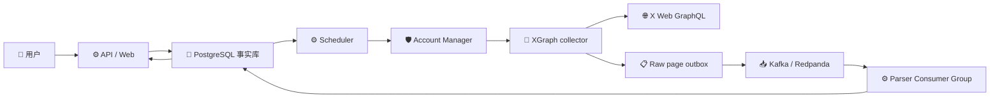

# XGraph 技术设计与分阶段实施方案

_XGraph 工业化 X 关系采集与分析系统；技术基线 v0.1；2026-09-03_

---

## 📋 文档定位

本文把 [XGraph 产品需求文档](xgraph-product-prd.md)转换为可实施、可测试、可退出的工程阶段。本文记录阶段性交付合同；上游代码来源和持续讨论材料只作为 `docs/upstream/` 与版本记录保留。

当前输入证据包括：`twscrape/` 上游源码与 fixture、2026-09-04 用真实 Scraper Account 取得的 live 实测，以及项目运行产生的响应头观测。**容量基准取自 live 实测的按端点配额**（`Following` 500 / 15 min、`UserByScreenName` 150 / 15 min），此前登记的 `188 / 15 min` 未标注端点且与实测不符，已降级为账号池的保守初始值；运行时一律以每个 `(Scraper Account, operation)` 的响应头更新 `remaining/reset_at`。

本文不把以下内容当作跨账号、跨 operation 永久不变的平台事实：

- 上述配额数字（单账号单次观测，可能随账号年龄、认证状态和平台策略变化）
- cursor 跨账号可用性在其他 operation 或长时间后是否保持
- 非官方接口能够返回完整关系
- Kafka/Redpanda 在当前流量下必然带来吞吐收益

这些项目必须通过真实账号、真实响应和故障实验建立观测记录后，才能进入容量或验收结论。

## 🎯 系统目标与不变量

### 系统目标

XGraph 接收一份 Seed List，将其中每个 Seed Account 作为一棵独立 Root Tree，沿 `following` 关系向下采集至 L5，并保存 L5 产生的 L6 边界账号；随后对符合候选规则的账号采集 Timeline，最终提供任务控制、进度、关系图、账号查询、筛选和导出。

### 数据源与复用策略

XGraph 只有一个采集数据源：登录后的 X Web GraphQL 接口。系统不接第三方聚合 API，也不通过浏览器渲染页面。它使用 Scraper Account 的 Cookie、`auth_token`、`ct0`、Bearer Token 和 `x-client-transaction-id` 等 Web 请求要素，由 Python HTTP 客户端直接调用 `Following`、`UserByScreenName`、`UserTweets` 等 operation。

`twscrape/` 是同仓库的只读上游参考快照，提供以下可借鉴资产：

- 登录 Cookie 与请求头构造
- GraphQL operation、variables 和 features
- `x-client-transaction-id` 生成
- `AccountsPool`、`QueueClient` 的限流与错误处理经验
- Following / Timeline cursor 分页
- User / Tweet 结构归一化和固定响应 fixture

XGraph 运行时不 import `twscrape`。需要复用的逻辑在理解其依赖和许可证后复制、裁剪并改造到 `xgraph/`，来源 commit 和差异记录在 `docs/upstream/BASELINE.md`。这意味着 XGraph 自己维护协议兼容性；上游更新不会自动进入运行时。

这条选择有一个必须显式承担的代价：**`make update` 只重写 `twscrape/api.py`，不会更新 `xgraph/collector/operations.py` 中的 operation id 和 feature flag 副本。** X 每数周轮换一次 operation id，副本会静默过期，直到下一次真实采集全线失败才暴露。

因此复制协议常量必须配套漂移守卫：`tests/xgraph/test_protocol_drift.py` 在每次 `make update` 后比对两份副本，把一次生产事故降级为一条失败的测试。**任何新增的协议常量副本都必须同时进入该守卫**，否则复用策略在维护面上是不成立的。

### 业务不变量

```text
Seed List = 一次 Crawl Task
一个 Seed Account = 一棵 Root Tree
L0 = Seed
L0 -> L1 -> ... -> L5 -> L6 boundary
L6 只记录，不展开
同一 Task 内账号、边、operation 幂等去重
重复只终止当前分支，不停止其他分支或 Task
同一账号同一分页链串行
```

### 系统边界



## 🏗️ 目标架构

### 组件职责

| 组件 | 负责 | 不负责 |
| --- | --- | --- |
| FastAPI / Web | 创建任务、控制任务、查询、导出 | 直接持有 Cookie 或直接调 X |
| PostgreSQL | Task、Tree、Node、Edge、Frontier、checkpoint、配额、offset、幂等裁判 | 代替 Kafka 做事件扇出 |
| Scheduler | claim frontier、检查预算、选择 operation、请求编排 | 解析业务 JSON |
| Account Manager | XGraph 自有号池、Scraper Account 租约、operation 配额、冷却、换号 | 判断业务节点价值 |
| `twscrape/` reference | 协议、Cookie、签名、GraphQL、分页、限流和解析的参考源码与 fixture | 不参与 XGraph 运行时 |
| XGraph collector | 独立实现 Web GraphQL 请求、分页、响应信封和错误边界 | 不承担任务层 BFS 和产品评分 |
| Outbox Publisher | 将已写入数据库的原始页面发布到消息总线 | 修改业务图或发起 X 请求 |
| Kafka / Redpanda | 原始响应持久化、消费组扇出、重放、DLQ | 任务状态、唯一去重、长时分页链 claim |
| Parser | 解析原始页面、写节点/边/帖子、产生下一层 frontier | 发起 X 请求 |

### 关键数据流

```text
PostgreSQL frontier
    -> Scheduler 原子 claim
    -> Account Manager lease(operation)
    -> XGraph collector 请求 X Web GraphQL
    -> PostgreSQL 事务写 raw_page_outbox + cursor checkpoint
    -> Outbox Publisher
    -> Kafka x.pages.raw
    -> Parser Consumer Group
    -> PostgreSQL 幂等写节点/边/下一层 frontier
```

### Kafka Consumer Group 基线

| Topic | Consumer Group | 用途 |
| --- | --- | --- |
| `x.pages.raw` | `xgraph-parser-v1` | 正常解析并生成业务结果 |
| `x.pages.raw` | `xgraph-reparse-<schema>-<run>` | Parser 升级后的历史重放 |
| `x.pages.raw` | `xgraph-archiver-v1` | 原始响应归档到冷存储 |
| `x.pages.dlq` | `xgraph-dlq-observer-v1` | 错误聚合、告警和人工重放登记 |

同一消费组内通过 Partition 分摊工作；不同消费组各自消费完整事件流。Kafka Partition Leader、Follower、Group Coordinator 和 Group Leader 只负责消息系统内部协调，不拥有 XGraph 的业务状态。

### 一致性合同

XGraph 采用：

```text
at-least-once delivery
+ transactional outbox
+ event_id 幂等（页面身份，不是响应内容摘要）
+ PostgreSQL 唯一约束
+ transactional checkpoint
+ assignment_epoch fencing
```

不承诺外部 HTTP exactly-once。请求可能已经到达 X、但 Worker 在收到响应前崩溃；系统必须保证重复尝试不会产生重复节点、重复边、重复计数或静默丢失已持久化的原始页面。

`event_id` 必须由 `(operation, account_id, cursor_in)` 派生，**不能包含响应内容**。同一页重取时互动计数已经变化，内容摘要会产生一个新的 `event_id`，页面因此被入库两次、被 Parser 计数两次，三条件完成判定永远无法配平。配合 `task_id` 作为主键，这正是阶段 2 列出的 `UNIQUE(task_id, account_id, operation, cursor_in)` 页面键。实现见 `xgraph/collector/client.py::page_event_id`。

## 🧭 阶段总览

| 阶段 | 名称 | 核心产物 | 进入下一阶段的硬门槛 |
| ---: | --- | --- | --- |
| 0 | 上游资产盘点与协议基线 | 复用清单、来源记录、协议合同、已知测量基线 | 明确复制什么、不复制什么，以及 XGraph 自有边界 |
| 1 | 独立协议采集内核 | XGraph collector、号池基础类型、PageEnvelope、错误分类和请求观测 | 不 import 上游，fixture/Mock HTTP 测试通过；真实小样本需凭证后执行 |
| 2 | 持久调度与账号池 | PostgreSQL frontier、Account Manager、预算和恢复 | 并发 claim 无重复，崩溃可恢复，零预算越界 |
| 3 | Kafka 原始事件管道 | Outbox、Publisher、raw/dlq Topic、Parser Group | Broker/Consumer 故障不丢已提交页面，重复事件幂等 |
| 4 | L0-L6 关系采集 | 分层 BFS、去重、collision、checkpoint、完成判定 | 合成图和真实小任务均满足深度与边界合同 |
| 5 | Timeline enrichment | 候选队列、帖子过滤、互动聚合、独立暂停 | 只对候选消耗 Timeline 配额，失败不阻塞图 |
| 6 | API、查询与前端 | 任务控制、进度、表格、图谱、导出 | E2E 结果可查询、可恢复、可导出 |
| 7 | 生产高可用与 scale up | 三 Broker、监控、演练、运行手册 | 故障演练达成 RTO/RPO 和容量指标 |

每个阶段都必须留下：实现变更、测试记录、指标快照、未解决风险和是否允许进入下一阶段的结论。

### 当前实施状态

| 阶段 | 状态 | 已验证内容 | 尚未验证内容 |
| --- | --- | --- | --- |
| 0 | 完成 | 上游复用台账、协议范围、上游快照隔离；2026-09-04 live 实测取代推测基线，三项待验证项全部结清 | 端到端真实小任务 |
| 1 | 完成（本地/fixture） | 独立 X Web collector、`UserByScreenName`、`Following`、`UserTweets`、PageEnvelope、cursor、配额头、错误分类 | 使用真实 Scraper Account 的 live smoke |
| 2 | 完成 | PostgreSQL schema、Seed Task、frontier claim/恢复、Task/operation 预算与重试预算、Account Manager 可用性不变量、真实 PG 集成门（CI service 容器） | Secret Store 与实际 Scheduler loop 在后续集成 |
| 3 | 完成 | Transactional outbox、Publisher、`x.pages.raw` / `x.pages.dlq`、Parser Consumer、`processed_events`、数据库 offset 与 epoch fencing、reparse 消费组、真实 Kafka 集成门 | 多 Broker 副本与 Rebalance 演练属阶段 7 |
| 4 | 完成 | 分层 BFS、层级 barrier、Task 内去重与 collision、L6 边界、覆盖率与终止原因、每层规模指标、合成图集成门 | 真实 Seed List 的 L0-L6 需凭证后执行 |
| 5 | 完成 | 候选准入、独立 `UserTweets` 队列与配额桶、帖子分类与样本上限、聚合指标、独立暂停、真实 PG 集成门 | 真实账号的 Timeline 样本 |
| 6 | 后端完成 | 任务控制与状态、账号/关系查询、受限子图、CSV / JSON 导出与溯源、凭证隔离、真实 PG 集成门；2026-09-04 完成真实端到端运行 | 浏览器前端 |
| 7 | 未开始 | 目录和技术合同已预留 | 多机部署与故障演练 |

2026-09-04 用两个真实 Scraper Account 完成首次端到端运行，详见 [首次端到端真实运行](xgraph-e2e-run-2026-09-04.md)。整条链路成立；运行中发现并修复了一处调度器租约泄漏。

## 🧪 阶段 0：上游资产盘点与协议基线

### 目标

把 `twscrape` 中与 XGraph 有关的协议实现、依赖链和 fixture 盘点清楚，形成可复制资产清单。该阶段接受已有 `188/15 min` 实测，不重复做一轮数据源可行性研究；只标记会改变实现合同、且无法从上游源码或已有样本确定的缺口。

### 实现范围

- 固化 ID、depth、operation、cursor、Task/Tree 术语
- 定义 `PageEnvelope`、`RawPage`、`Frontier`、`ScraperAccount` 最小字段
- 盘点 `api.py`、`queue_client.py`、`accounts_pool.py`、`http.py`、`login.py`、`xclid.py`、`utils.py`、`models.py` 的必要依赖
- 建立“上游文件/函数 → XGraph 目标模块 → 复制或重写 → 来源 commit”的复用台账
- 确认第一版只实现 `UserByScreenName`、`Following` 和 `UserTweets`，不复制无关 operation
- 把按端点的实测配额登记为容量基线，并注明观测时间与来源账号
- 复用并脱敏上游 Following / UserTweets fixture，建立 XGraph 自己的协议回归样本
- 把平台分页硬顶和 cursor 跨账号能力列为集成测试项，不阻塞 domain 与 collector 开工

### 测试与指标

| 检查 | 方法 | 达成标准 |
| --- | --- | --- |
| 依赖盘点 | 从公开方法追到 HTTP、登录、签名、解析和账号池 | 没有遗漏隐式全局状态或运行时依赖 |
| 来源台账 | 每段拟复制逻辑关联上游文件和 commit | 许可证、来源和本地差异可追溯 |
| 字段合同 | 用固定响应 fixture 核对 `User` / `Tweet` | 必填字段有明确缺失语义，ID 全程为字符串 |
| 协议范围 | 列出第一版 operation 和必要请求要素 | 不复制 communities、lists、trends 等无关能力 |
| 配额基线 | 登记测试方法与按端点的实测结果 | 作为默认值进入 Account Manager，不散落为魔法常量 |
| 运行时隔离 | 静态检查 `xgraph/` import | `xgraph/` 中没有 `import twscrape` |

### 退出门槛

```text
必须完成：上游复用台账和许可证/commit 记录
必须完成：XGraph 协议合同与第一版 operation 范围
必须完成：Task/Tree/L0-L6/去重语义评审
必须完成：按端点的配额基线进入可覆盖配置
禁止：整包复制 twscrape 或让 XGraph 运行时 import 上游
```

## 🔌 阶段 1：独立协议采集内核

### 目标

在 `xgraph/` 中实现协议级采集：用 XGraph 自己的 Cookie 会话、Web 请求、GraphQL operation、分页和解析代码直接调用 X Web。参考 `twscrape/` 的成熟实现，但不保留它的公开 API、CLI、SQLite 账号库和运行时对象。

### 实现范围

- XGraph collector 产生统一的 `PageEnvelope`
- 实现 Cookie / `auth_token` / `ct0` 加载和敏感字段脱敏
- 实现必要请求头、Bearer Token、GraphQL variables/features 和 `x-client-transaction-id`
- 传输层提供 `httpx` 与 `curl-cffi` 双后端；**默认使用 curl-cffi**，未安装时回退并告警
- User-Agent 按浏览器族提示（`@chrome` 等）解析，seed 由 Scraper Account alias 派生，保证同一账号跨重启呈现同一浏览器
- 全部出站请求走同一个传输边界，不在业务层直接构造 HTTP 客户端
- 实现 `UserByScreenName`、`Following` 和 `UserTweets` 三个 operation
- 在 `xgraph/accounts/` 建立 XGraph 自有 Scraper Account 与 operation quota 基础类型
- 在真实 HTTP 发出前后记录 physical attempt
- 暴露 operation、cursor_in、cursor_out、headers、status 和错误分类
- 复制并裁剪上游 `_flatten_user_v2` / `_flatten_tweet_v2` 所需逻辑，转成 XGraph 自有模型
- 以纯加法补入 `dm_permissions.can_dm`
- 在解析响应体之前识别边缘拦截（HTML 响应 + `cf-ray`），与"响应格式错误"区分开：前者说明账号与出口被质询，后者说明 payload 有问题
- 解析 Timeline 时只取顶层 entry，并为每条帖子解析唯一的 `TweetKind`（`RETWEET > REPLY > QUOTE > ORIGINAL`）
- 增加取消、超时和明确终态，不无限重试 `(336)` 结构性错误
- 建立协议漂移守卫，比对 XGraph 与上游快照的 operation id 和 feature flag
- 不复制 telemetry、上游 CLI、无关 GraphQL operation 和 SQLite DB

### 测试与指标

| 检查 | 达成标准 |
| --- | --- |
| 上游快照保护 | `git diff -- twscrape/` 为空 |
| 运行时隔离 | `xgraph/` 不 import `twscrape` |
| Fixture 差分 | 同一 `raw_following.json` / `raw_user_tweets.json` 的核心字段与上游解析结果一致 |
| 请求计数 | 每次真实 HTTP attempt 都有一条记录；成功、失败、429、超时可区分 |
| 错误分类 | `(88)`、`(326)`、`(32)`、`LoadShed`、`(336)` 按合同处置；边缘拦截产生独立的 `BlockedError` |
| 帖子口径 | 只有顶层 entry 进入结果；纯 repost 和 reply 被分类但不进入合格样本；缺失浏览量保持为空 |
| 协议漂移 | operation id 与 feature flag 与上游快照一致；不一致时测试失败并指出具体差异 |
| 取消语义 | 取消后不再发新请求，当前请求有明确终态 |
| 敏感信息 | 日志、PageEnvelope 和测试输出不包含 Cookie、`auth_token`、`ct0` |
| 传输指纹 | 默认后端为 curl-cffi；User-Agent 提示不出现在线路上；同一账号的 UA 稳定 |
| 最小实跑 | 使用测试 Scraper Account 完成账号解析、Following 多页和 UserTweets 多页 |

### 退出门槛

```text
上游快照无改动，XGraph 运行时无上游 import
Fixture 差分测试和 Mock HTTP 测试通过
传输层默认走 curl-cffi，且业务层没有绕过传输边界的 HTTP 客户端
真实 live smoke 需在安全配置凭证后单独执行
每一次真实请求均可审计
采集内核不承担 BFS、任务状态和业务去重
```

## 💾 阶段 2：持久调度与 Scraper Account 池

### 目标

先让长任务在没有 Kafka 的情况下具备可恢复、可限流和多 Worker 安全运行能力。PostgreSQL 是任务事实库，frontier 是持久工作表。

### 实现范围

#### PostgreSQL 核心表

最小表集合：

```text
crawl_tasks
root_trees
account_nodes
follow_edges
crawl_frontier          -- 含 max_attempts；耗尽预算的行不再被 claim，并由清扫转入 failed
scraper_accounts
account_operation_quota
request_attempts
raw_page_outbox
```

核心唯一约束：

```text
UNIQUE(task_id, account_id)                            -- account_nodes
UNIQUE(task_id, account_id, operation)                 -- crawl_frontier，一条分页链一行
UNIQUE(task_id, source_id, target_id)                  -- follow_edges
UNIQUE(task_id, account_id, operation, cursor_in)      -- raw_page_outbox，由稳定 event_id 实现
```

深度取值必须覆盖闭环：**`follow_edges.target_depth` 允许 0**。L1 及以下的账号回头关注 Seed 时产生的边，其目标节点深度为 0；把该列约束为 1..6 会恰好拒绝掉承载圈层信号最强的那批边。

#### Frontier claim

Scheduler 使用数据库事务 claim：

```sql
SELECT id
FROM crawl_frontier
WHERE status = 'pending'
  AND not_before <= now()
ORDER BY priority DESC, depth ASC, id
FOR UPDATE SKIP LOCKED
LIMIT 1;
```

领取后写入：

```text
owner_id
lease_expires_at
attempt
status = running
```

租约过期后，其他 Scheduler 可以接管。这个租约是崩溃保护，不是业务完成标记。

#### Account Manager

最小接口：

```text
lease(operation) -> ScraperAccount | None
release(account, operation, response_headers)
report(account, operation, error_class)
```

状态按两层保存。两层不可合并：`status` 回答"这个账号还能不能用"，`state` 回答"这个 operation 现在为何不可用"；混用会导致无法区分"池子被占满"与"池子被限流"，而两者的应对方向相反。

```text
account.status = active | cooling | dead | standby
quota(account_id, operation).state = ready | cooling | leased | disabled
quota(...) = remaining, limit_max, reset_at, in_flight, lease_expires_at, consecutive_errors
```

**可用性判据必须是全集。** 每个 `(state, remaining, reset_at, lease)` 组合都要明确落在"可租用"或"有正当理由不可租用"的一侧，否则会出现租约查询永远选不中、又不报错的行——账号池静默缩小，表现为"越来越慢"而不是"报错"。数据库层用三条 CHECK 把这些状态变成不可表示：

```text
state <> 'cooling' OR reset_at IS NOT NULL      -- 冷却必须有结束时间
state <> 'leased'  OR lease_owner IS NOT NULL   -- 租用中必须有持有者
state <> 'ready'   OR remaining > 0 OR reset_at IS NOT NULL   -- 就绪必须可支出
```

`consecutive_errors` 达到预算后进入 `disabled`，而不是无限重试：终态必须是显式的。

### 测试与指标

| 检查 | 达成标准 |
| --- | --- |
| 并发 claim | N 个 Scheduler 并行运行，单条 frontier 同时只有一个有效 owner |
| 租约恢复 | 杀掉持有者后，租约过期，其他 Worker 可接管 |
| 预算保护 | 请求发出前检查 Task、operation、账号和全局预算；硬预算零越界 |
| 配额利用率 | 记录实际速率 / 当前理论速率；低利用率可定位到 lease、锁或限流等待 |
| 账号切换 | cooling/dead 账号不会被继续分配；standby 只在策略触发后启用 |
| 租约不泄漏 | 租约取得之后的任何异常路径都必须归还账号；用只有一个账号的池验证 |
| 事务边界 | raw page、cursor checkpoint、request attempt 不能出现静默半写状态 |
| 账号可用性 | 任何 release/report/崩溃路径之后，行要么可租用，要么处于带结束时间的冷却或显式 disabled |
| 重试终态 | 用尽 attempt 预算的 frontier 行停止被 claim，并进入 `failed`，不停留在 pending |
| 真实数据库 | 上述契约在 CI 的 PostgreSQL service 上执行；跳过即视为未验证 |

### 退出门槛

```text
至少两个 Scheduler 并行 claim 无重复
杀进程后 frontier 可恢复
账号限流、封禁、认证失效三类状态可区分
全局请求预算和 operation 预算没有越界样本
账号池不存在静默不可用的 (account, operation) 行
PostgreSQL 契约测试在 CI 中实际执行而非 skip
```

## 📨 阶段 3：Kafka 原始事件管道

### 目标

把“不可逆的 X 请求”和“可重复的 Parser 处理”隔离。Kafka 只承载原始响应事件，不承载长时间的 Following 分页链状态；frontier 和 cursor 仍在 PostgreSQL。

### 实现范围

#### Topic

第一版只建立：

```text
x.pages.raw    partition key = account_id
x.pages.dlq
```

`x.pages.raw` 使用稳定 `event_id`，保留 `schema_version`、`task_id`、`tree_id`、`account_id`、`operation`、`depth`、`cursor_in`、`cursor_out`、请求时间、响应头摘要和原始 payload。

**事件不携带解析结果。** 保留原始流的意义就是让新版 Parser 重新解释同一批字节；把当下的解析一起发出去等于冻结这个决定。`RawPageEvent` 因此只带 payload 和元数据，不带 `users` / `tweets`。

分区键取 `account_id`，使同一账号的分页在同一分区内保序，也便于按账号整体重放。

#### Transactional outbox

Scheduler 收到响应后在同一个 PostgreSQL 事务中：

```text
写 raw_page_outbox
写 cursor checkpoint
写 request attempt
更新 produced_count
```

Outbox Publisher 领取未发布行，发布成功并收到 `acks=all` 后标记 published。

**Publisher 必然是 at-least-once**：它可能在 `send` 与 `mark_published` 之间崩溃。反过来先标记再发送，则会在发送失败时丢页，而数据库与 Broker 没有共享事务可以让这一对原子化。因此重复发布是允许的，由 Parser 通过 `processed_events` 吸收。

Publisher 侧的失败有上限：重试若干次仍失败的行进入 `dead_lettered`，不再占用发布容量，但保留可见——它是用 X 配额换来的，无法免费重取。

#### Parser Consumer

Parser 处理一条事件时在同一个 PostgreSQL 事务中：

```text
登记 processed_events
写 User / Tweet / Edge
写下一层 frontier
更新 processed_count
更新 consumer_offsets
```

offset 行必须带：

```text
group_id + topic + partition + owner_id + assignment_epoch
```

Rebalance 后旧 Consumer 的 epoch 无效，数据库拒绝其写入。取得分区时 `assignment_epoch` 自增，旧持有者即使仍在处理批次，其写入也匹配不到任何行。

**终态事件也必须推进 offset。** 无论是结构性错误还是无法解码的消息，若只写 DLQ 而不推进 offset，分区会永远卡在一条不可能成功的消息后面。无法解码的消息没有 `task_id`，因此只推进 offset、不计入任务；可解析但永久失败的页则照常登记，计入 `pages_processed`——它必须参与完成判定。

### 测试与指标

| 检查 | 达成标准 |
| --- | --- |
| Producer 双写故障 | DB 提交后 Publisher 崩溃不会丢 raw page |
| 重复发布 | 同一 `event_id` 发布 2 次，业务结果和 `processed_count` 只计一次 |
| Parser 崩溃 | 写库前后分别杀 Parser，恢复后无静默丢页 |
| Rebalance fencing | 旧 Consumer 恢复后无法推进 offset 或写业务状态 |
| DLQ | `(336)` 和不可恢复解析错误进入 DLQ，不无限消耗 X 配额 |
| Lag | 记录 topic/partition lag、最老事件年龄和 Parser 处理速率 |
| 原始数据 | Kafka 保留期、压缩、磁盘使用量可观测 |
| 事件内容 | 事件体不含解析结果，重放时由当前 Parser 重新解释 |
| 终态推进 | DLQ 事件仍推进 offset；分区不会卡在不可恢复的消息后 |

### 退出门槛

```text
已提交到 outbox 的原始页在 Publisher 故障后最终可发布
重复事件不重复计数、不重复写图
Parser Rebalance 不造成旧 Worker 越权写入
可以启动独立 reparse Consumer Group，不发出新 X 请求
```

## 🌳 阶段 4：L0-L6 关系采集

### 目标

把阶段 2 的 frontier 和阶段 3 的事件流组合成真正的关系采集任务，并严格兑现多 Seed forest、按层边界、Task 内去重和 L6 停止语义。

### 实现范围

#### 按层封边界

推荐采用 Task 范围的层级 barrier：

```text
所有 Seed 完成 L0
    -> 开放 L1
所有 L1 完成
    -> 开放 L2
...
所有 L5 完成
    -> 记录 L6，Task 的 EXPAND 完成
```

层级 barrier 必须同时观察：

```text
当前层 frontier 没有 pending/running
该层已产生的 raw event 已全部解析
该层没有 in-flight 请求
没有等待中的可重试项
```

#### 深度和边界

```text
source_depth <= 5：允许请求 Following
target_depth <= 5：可创建下一层 EXPAND
target_depth == 6：写边和边界节点，不创建 EXPAND
```

#### 分页链截断

成本模型反转后（每账号请求数与其关注数成正比且无上限），单条分页链必须有截断上限，否则一个关注数万人的账号会独占整轮配额。

当前该上限是 `ExpansionScheduler` 的 `max_pages_per_chain` 构造参数。**它的位置不对**：截断阈值是任务配置而不是 worker 配置，无法按任务设置不同的值。

截断还会污染覆盖率：链路被主动截断时 `termination_reason` 记为 `page_limit`，但 `declared_following` 与 `collected_following` 的比值此时不表示「平台给了多少」，而表示「我们停在哪」。**覆盖率计算必须把主动截断与平台截断区分开**，否则前者会被读成后者。

#### 去重和 collision

```text
物理账号节点：Task 内唯一
物理 Following expansion：Task 内唯一
物理关系边：Task 内唯一
发现路径：保留 incoming tree/source/path 证据
重复：记录 collision，只结束当前分支
```

按层执行时，首次持久 claim 的 depth 天然是 Task 范围内最短深度。若未来改成逐 Seed 串行，必须额外实现跨 Tree 邻接复用与逻辑深度松弛，不能只写 `depth = min(old, new)`。

`tree_id` 随 frontier 行进入事件、再进入 observation，因此"这个账号是从哪棵树、哪个上游、哪一层被发现的"是被记录的事实而非事后推断。一个被多棵树发现的账号只有一行节点、一行 frontier，但有多行 observation。

#### 展开过滤

`min_followers_to_expand` 控制的是遍历成本，不是候选判断：被过滤的账号照常写入节点、profile 和边，只是不再消耗一次请求，`expansion_status` 记为 `filtered`。候选筛选发生在完成的图之上，是另一个问题。

粉丝数缺失不当作零——平台未暴露 profile 是证据缺口，不是"这个账号很小"，静默丢弃会让图偏向平台恰好愿意暴露的那部分。

### 测试与指标

| 检查 | 达成标准 |
| --- | --- |
| 合成图深度 | 100% 节点落在预期 L0-L6；没有 L6 expansion |
| 多 Seed | 每个 Seed 保留独立 Root Tree；共享账号只保留一份节点 |
| 边去重 | 重复消息和重复路径不产生重复业务边 |
| collision | 记录 incoming tree/source/depth/时间；不停止其他分支 |
| 分页恢复 | 在任意页后杀 Scheduler，恢复后从 checkpoint 继续 |
| 层级 barrier | 未完成当前层时不会领取下一层；Parser 积压归零后才开层 |
| 完成判定 | frontier 为空、解析积压归零、无 in-flight 三条件同时满足 |
| 规模指标 | 每层节点、边、重复率、过滤率、请求数、终止原因均可查询 |
| 观测覆盖率 | 保存 declared、collected、termination_reason 和覆盖率分布 |
| 过滤审计 | 被过滤账号保留节点、profile 和边，并记录 `filter_reason` |
| 闭环边 | 指向 Seed 的边（`target_depth = 0`）被正常记录 |

### 退出门槛

```text
合成图测试全部通过
真实小 Seed List 完成 L0-L6
L6 没有任何后续请求
重复、重试、崩溃均不产生重复节点/边/计数
Task 完成状态不会因 Kafka 积压或重复事件提前/永久错误结束
```

## 📊 阶段 5：Timeline enrichment

### 目标

在不阻塞关系图的前提下，为候选账号补充最近 30 篇合格帖子和互动指标。Timeline 是独立 enrichment，可以整体暂停。

### 实现范围

- 候选规则使用 Following 响应中已有字段进行初筛；准入记录**命中的条件列表**而非分数，PRD 明确禁止把启发式包装成结论
- 候选准入与入队在同一条语句内完成，不存在"被标记为候选但没有工作项"的中间态
- 单独创建 `TIMELINE` frontier / operation
- Timeline 使用自己的 `(Scraper Account, UserTweets)` 配额桶
- 过滤 reply 和纯 repost，保留原创与 Quote
- 保存样本数量、时间跨度和缺失字段；纯 repost 与 reply 一并入库并标记为不合格，否则"扫了多少条"无法核对
- 聚合指标由样本**重算**而非累加：数字可追溯到具体帖子，重复投递也不会让它膨胀
- 计算平均回复、转发、点赞、浏览量，以及中位数和互动率
- 支持 `timeline_enabled = false`，不影响 EXPAND

#### 与遍历的隔离

Timeline 与 EXPAND 共用 frontier 表，但**层级 barrier 只统计 `Following`**。让一个在途的 Timeline 请求把某一层撑开，等于让图去等它并不需要的数据。同理，`claim_frontier` 只对 `Following` 施加层级门，Timeline 行任何时候都可领取。

调度器的停止判断**只数自己取回的页**，不读 Parser 的产出。两者按设计异步运行，Parser 可能落后数分钟；若从库里读已存帖子数来决定要不要翻下一页，enrichment 一旦落后就会无限翻页。库只在链路开始时读一次，用于接续被中断的链路。

`max_scanned` 小于 `target_posts` 是合法配置而非错误：合格率约五分之一，一个几乎只转发的账号否则会被翻到远超其价值的深度。

### 测试与指标

| 检查 | 达成标准 |
| --- | --- |
| 候选准入 | 非候选账号不产生 Timeline 请求 |
| 帖子过滤 | fixture 中 reply/repost/原创/Quote 分类稳定，纯 repost 和 reply 不进入样本 |
| 样本上限 | 每账号最多保存 30 篇合格帖子；不足时记录真实 `sample_count` |
| 指标口径 | 空浏览量不当作 0；平均值和样本数可追溯到帖子集合 |
| 独立暂停 | 关闭 Timeline 后 EXPAND 仍推进；已有 Timeline in-flight 按暂停策略收敛 |
| 配额隔离 | Following 与 UserTweets 配额分开统计，Timeline 失败不烧 EXPAND 重试预算 |
| barrier 隔离 | 在途 Timeline 工作不会让任何一层保持开启 |
| 停止判断 | 调度器不依赖 Parser 进度决定是否继续翻页 |
| 准入证据 | 记录命中条件列表，可复核；不产生单一分数 |

### 退出门槛

```text
Timeline 不阻塞图完成
候选之外没有额外 Timeline 请求
30 篇、过滤和聚合指标通过 fixture 与真实小样本验证
Timeline 可独立暂停、恢复和重试
```

## 🌐 阶段 6：API、查询与浏览器

### 目标

把已经可恢复、可审计的数据管道变成可使用的产品，而不是先做一个无法反映真实数据质量的图形 Demo。

### 实现范围

#### 任务控制

```text
导入 Seed List
校验并确认
开始 / 暂停 / 继续 / 终止
查看当前层、frontier、限流等待、错误和积压
```

#### 查询与导出

- 账号列表：层级、Seed、followers、`can_dm`、认证、活跃度和完整性状态
- 关系列表：source、target、tree、depth、collision 和来源时间
- 账号详情：Profile、路径、Following、Timeline、互动指标和警告
- CSV / JSON 导出：生成时间、Task、筛选条件和数据完整性状态

导出携带 manifest：`task_id`、`dataset`、实际生效的筛选条件、生成时间、行数、任务状态、`expansion_complete`、`parser_backlog` 和覆盖率摘要。CSV 没有位置放这些，因此 manifest 走 `x-xgraph-manifest` 响应头。**一份不说明自己出自哪次任务、哪些条件、当时爬完没有的 CSV，一周后就没法用了。**

导出按页遍历查询层，内存占用与页大小成正比而非与任务规模成正比；manifest 声明的行数就是文件实际包含的行数。

#### 图谱

默认只查询受限子图：Seed 周围若干跳、候选账号邻域、共同节点或用户指定节点集合。禁止一次性把百万级节点全部送入浏览器。

子图响应必须同时返回 `matched_nodes` 与 `bounded`：**受限的答案不能看起来像全图**。返回的边两端都在返回的节点集合内，否则前端会画出指向不存在节点的悬空边。

### 测试与指标

| 检查 | 达成标准 |
| --- | --- |
| E2E 任务 | 从导入到 L6、Timeline、查询和导出走通一条真实小任务 |
| 控制语义 | 暂停不再产生新请求；继续可从 checkpoint 恢复；终止有明确终态 |
| 查询正确性 | API 返回的 depth、tree、collision 与数据库事实一致 |
| 导出完整性 | 导出可重现 Task、筛选条件和生成时间；ID 保持字符串 |
| 图谱边界 | 大图查询有节点/边上限和分页，不因浏览器渲染导致任务失败 |
| API 性能目标 | 受限列表查询 P95 目标小于 500 ms；超限查询返回分页而非超时 |
| 安全 | Cookie、代理凭据和内部账号状态不出现在 API 和导出 |
| 质量标注 | 每个账号行携带 `warnings`（截断、边界、失败、过滤、多路径发现）与 `coverage_ratio` |
| 控制语义 | 未定义的状态转移返回 409 而非静默忽略；暂停释放无人认领的租约 |
| 排序注入 | 排序字段来自白名单，非法值在构造过滤器时即拒绝 |

### 退出门槛

```text
浏览器可以控制任务并观察真实状态
账号表、关系表、图谱和导出使用同一事实库
前端能显示 partial、failed、collision、L6 boundary 等数据质量状态
```

## 🛡️ 阶段 7：生产高可用与 scale up

### 目标

把“架构支持分布式”升级为“经过故障演练的多实例部署”。本阶段才验证 Broker Leader 切换、Consumer Rebalance、跨机器 Worker 和容量扩展。

### 部署基线

```text
HTTP 传输：curl-cffi 后端（浏览器 TLS 指纹 + HTTP/2）
XGRAPH_HTTP_BACKEND：生产显式设为 curl，使缺失依赖成为启动错误而非静默回退
PostgreSQL：共享事实库，具备备份和恢复流程
Kafka/Redpanda：至少 3 Broker
Topic replication.factor：3
min.insync.replicas：2
Producer acks：all
Producer enable.idempotence：true
unclean leader election：false
Consumer enable.auto.commit：false（offset 在 PostgreSQL，不能有第二个真相源）
x.pages.raw 保留期：≥30 天，压缩必开（未压缩约 1 GB/小时）
```

单节点 Redpanda 只能用于开发和功能测试，不能作为生产高可用证据。

### 扩展方式

| 组件 | 扩展方式 | 真实上限 |
| --- | --- | --- |
| Scheduler | 增加实例，共享 frontier claim | X 配额、数据库和账号池 |
| Scraper Account | 增加执行账号和出口 | 账号质量、风控和 operation 配额 |
| Outbox Publisher | 增加实例，共享 outbox claim | 数据库读写和 Kafka Producer |
| Parser | 增加同组 Consumer | Topic Partition 数和数据库写入 |
| Reparse / Archiver | 增加独立 Consumer Group 实例 | 历史事件和冷存储吞吐 |
| Broker | 增加节点和副本 | 磁盘、网络、副本同步和运维能力 |

### 故障演练与指标

| 演练 | 目标指标 |
| --- | --- |
| 杀 Scheduler | frontier lease 在目标时间内恢复；不丢任务 |
| 杀 Publisher | outbox 最终发布；不丢已提交 raw page |
| 杀 Parser | Consumer Group 接管；结果不重复、不缺失 |
| Broker Leader 故障 | 同步副本接管；已确认事件不丢 |
| PostgreSQL 短暂不可用 | Worker 退避，不超发 X 请求；恢复后继续 |
| Scraper Account 批量失效 | dead/cooling 正确隔离，standby 按策略启用 |
| Parser 版本升级 | 新 Consumer Group 重放；旧组不被破坏 |
| 重复消息洪峰 | `processed_events` 和唯一约束保持稳定 |

建议在首次生产演练前冻结以下目标，并用实测替换：

```text
RPO：已提交到 PostgreSQL outbox 的原始页面 = 0
RTO：单个 Worker 故障恢复在 5 分钟内
Broker 单节点故障：业务持续可用，允许短暂 Rebalance
Parser 重放：不产生任何新 X 请求
预算越界：0 次
敏感信息泄露：0 次
```

### 退出门槛

```text
至少一次完整多机故障演练通过
三 Broker 副本和 Leader 切换有日志证据
Parser Rebalance 和旧 Consumer fencing 有测试证据
Kafka lag、frontier age、outbox age、配额利用率可监控
容量报告同时给出 X 外部速率和内部 Parser 速率
```

## 📈 统一指标与验收口径

### 指标分层

| 类型 | 含义 | 例子 |
| --- | --- | --- |
| 硬不变量 | 违反即失败 | L6 不展开、预算不越界、ID 不变类型 |
| 数据正确性 | 结果是否符合业务合同 | 去重、depth、collision、checkpoint |
| 可用性目标 | 故障后能否继续 | lease 恢复、Rebalance、outbox 发布 |
| 容量指标 | 当前系统能处理多少 | X req/s、Parser events/s、frontier growth |
| 质量指标 | 结果是否值得使用 | coverage ratio、partial 比例、终止原因 |
| 观测指标 | 是否能解释问题 | lag、queue age、P95、账号 cooling 数、outbox backlog、`pages_produced - pages_processed` |

### 统一验收样本

每次阶段验收至少保存：

```text
Task ID
Seed List（脱敏或内部引用）
代码 commit
Scraper Account 数量和 operation 配额观测
请求 attempts / succeeded / rate_limited / failed
每层节点、边、collision 和终止原因
Kafka topic/partition/consumer group 状态
frontier、outbox、Parser lag 快照
导出文件校验和
```

### 最终验收不是单一“爬完”

一个 Task 只有在以下条件同时满足时才可以标记 `completed`：

```text
EXPAND frontier 无 pending/running/retryable
所有已生产的 EXPAND raw event 已处理
无 EXPAND in-flight HTTP 请求
当前层 barrier 已闭合
L5 来源已处理，L6 已记录且没有 L6 expansion
```

Timeline 作为独立 enrichment 状态记录，不应因为候选 Timeline 的积压而伪造关系图未完成。

## 📐 测量基线与证据

本节记录容量模型和数据口径背后的实测值。每条都标注来源等级，避免推导值在后续讨论中被当成平台事实使用。

| 等级 | 含义 |
| --- | --- |
| **实测** | 在真实响应样本或真实数据库上取得，可复现 |
| **单一来源** | 只有一个外部来源支持，尚未独立验证，不得进入验收结论 |
| **推导** | 由实测值计算得出，随输入变化 |

样本来源：`tests/mocked-data/raw_following.json`、`raw_user_tweets.json`、`raw_user_by_login.json`，各一页，来自单个账号。分页条数与字段结构属于平台行为，可直接采信；比例类统计量样本量不足，仅作量级参考。

### 分页与请求账本

| 项 | 值 | 等级 | 说明 |
| --- | --- | --- | --- |
| Following 单页条数 | **首页 70，其后 50** | 实测（live） | 请求发送 `count: 20`，平台忽略该参数。此前记录的"60 条"取自单页 fixture，不具代表性 |
| Following 总量上限 | **不存在** | 实测（live） | 见下方"约 800 上限已证伪" |
| `EXPAND` 每账号请求数 | **`ceil(declared_following / 50)`** | 实测推导 | **没有上界**。关注 3 万人的账号需要约 654 次请求 |
| `PROFILE` 每账号请求数 | **0** | 实测 | Following 响应直接携带完整 User 对象，不存在独立 profile 阶段 |
| Timeline 合格帖占比 | **19%** | 实测（live 复核） | fixture 上 4/21；live 三页 12/63，两次独立观测一致。样本仍为企业类账号，个人 KOL 应更高 |
| `TIMELINE` 每账号请求数 | **约 8** | 实测推导 | 单页 21 条顶层帖、合格率 19%，凑 30 篇需约 8 页 |

### 约 800 上限已证伪

2026-09-04 用一个真实 Scraper Account 对四档账号做完整分页：

| 账号 | 声明关注 | 实际采到 | 覆盖率 | 终止原因 |
| --- | ---: | ---: | ---: | --- |
| 小号（337） | 337 | 336 | 99.7% | 连续空页 |
| `~765` | 765 | 759 | 99.2% | 连续空页 |
| `~3.9k` | 3,929 | 3,003 | 76.4% | **探测脚本自身的 60 页上限** |
| `~32.7k` | 32,692 | 3,011 | 9.2% | **探测脚本自身的 60 页上限** |

后两个账号停在 3,003 与 3,011——正好是 60 页 × 50 条，**是探测脚本的常量而不是平台的**；两者终止时 cursor 均仍然存在。**平台没有在约 800 处截断关注列表。**

这同时解释了 twscrape issue #247 报告的"只取得约 10%"：`~32.7k` 账号在采到 9.2% 时被脚本自己停下，与该报告数量级一致。**那多半也是提前放弃，不是平台限制。**

> ⚠️ **成本模型因此反转。** 原先假设"每账号成本封顶约 13 次请求"，真实情况是**成本与该账号的关注数成正比且无上限**。一个关注 3 万人的账号可以吃掉半小时的账号配额。`max_following_scan` 因此从"可选的保守设置"变为**必需的成本控制**，其截断偏差必须按 📊 观察到的分布中的说明记录并降权。

分页中途会出现空页（观察到长度 0 与 14 的页），随后继续返回正常页。**遇到第一个空页即停会低估覆盖率**：`~765` 账号需要放宽到"连续三个空页才停"才取到 99.2%。这正是上游 `empty_pages >= 3` 常量存在的原因，该常量应保留而非收紧。

### 结束信号：X 不用空 cursor 表示列表结束

`Following` 链的自然终止条件曾写成"`cursor_out` 为空"。**在真实平台上这个条件几乎永不成立。**

| 项 | 值 | 等级 |
| --- | ---: | --- |
| 2,600 页中 `cursor_out` 为空的页数 | **1** | 实测（live, 2,600 页） |
| 2,600 页中 `cursor_out` 非空的页数 | **2,599** | 实测（live） |

后果是每条链都跑到页数上限，**无论对方关注多少人**。实测的逐页条数：

```text
账号 A  (声明  337)   [50,50,50,50,49,50,37, 0,0,0,0,0,0,0,0,0,0,0,0,0]
账号 B  (声明   11)   [11, 0,0,0,0,0,0,0,0,0,0,0,0,0,0,0,0,0,0,0]
账号 C  (声明    0)   [ 0,0,0,0,0,0,0,0,0,0,0,0,0,0,0,0,0,0,0,0]
账号 D  (声明 1714)  [71,51,50,50,51,50,50,50,50,50,50,49,48,50,50,50,50,50,51,50]
```

账号 C 关注 0 人，仍花掉 20 次请求。live 运行中 **129/130 个账号恰好花满 20 次**。

因此**结束信号只能是连续空页**，即上游 twscrape 的 `empty_pages >= 3`。把该运行的 2,600 页按抓取顺序回放通过这条规则：

| 项 | 值 | 等级 |
| --- | ---: | --- |
| 实际花费页数 | 2,600 | 实测 |
| 应用规则后 | **1,996** | 实测回放 |
| 节省 | **604（23.2%）** | 实测回放 |
| 由空页而非页数上限结束的链 | **63 / 132** | 实测回放 |

阈值不可收紧：分页中途会出现空页后又恢复正常页，`~765` 账号需要连续三次才不低估覆盖率。

### 覆盖率必须按终止方分开统计

`collected / declared` 这个比值在两种情况下算出的数字一样，含义完全相反：

- **平台结束**（`natural_end` / `empty_pages` / `cursor_stalled`）——X 交出了它愿意交的全部，比值是**覆盖率**
- **我方结束**（`page_limit` / `budget_exhausted`）——我们没有继续付费，比值是**我们的预算**

把两者平均在一起，得到的数既不是覆盖率也不是预算。用同一次 live 运行的 132 条链回放验证：

| 分组 | 链数 | 平均比值 |
| --- | ---: | ---: |
| 平台结束 | 63 | **0.999** |
| 我方结束（20 页上限） | 69 | 0.584 |
| **合并成单一数字** | 132 | **0.779** |

**0.779 会被读成"X 扣留了 22% 的关注关系"，而这是假的。** 平台结束的链平均交出 99.9%，最差一条也有 98.5%（差额是被封或注销的账号）。这同时是"约 800 上限不存在"的第二次独立确认。

因此 `coverage()` 返回两个计数：`truncated`（平台扣留）与 `scan_capped`（我方截断），`mean_coverage_ratio` **只对平台结束的链计算**；账号行的警告同样分成 `following_truncated` 与 `scan_capped`。

### 容量模型

**限流按端点分桶，且实测值与此前登记的 `188 / 15 min` 不符：**

| operation | `x-rate-limit-limit` | 等级 |
| --- | ---: | --- |
| `Following` | **500** | 实测（live, 2026-09-04） |
| `UserByScreenName` | **150** | 实测（live, 2026-09-04） |
| `UserTweets` | **50** | 实测（live, 2026-09-04） |

**三个桶相差十倍。** `UserTweets` 是最紧的一个，而 Timeline 恰好又是每账号请求数最多的操作——这两件事叠加，使 enrichment 的实际吞吐远低于遍历。

此前的 `188 / 15 min` 未标注端点，且与实测不符，**不再作为容量基准**；它仅保留为账号池的保守初始值，运行时一律以响应头覆盖。

以 `Following` 的 `500 requests / 15 min` 为基准：

```text
单账号速率  = 500 / 900s = 0.556 req/s
10 个账号   = 5.56 req/s = 20,000 req/hr
```

按 Little's Law 反推所需并发：

```text
in-flight = 吞吐 × 延迟
P95 = 1s  ->  约 2 个并发请求即可跑满
P95 = 3s  ->  约 6 个并发请求即可跑满
```

**本系统是配额受限系统，不是延迟受限系统。** 正确的 Worker 数是个位数，工程复杂度应集中在配额记账与调度精度上。任何"提高并发以提高吞吐"的改动在此模型下都无效。

> ⚠️ 以上为单账号单次观测。配额可能随账号年龄、认证状态与平台策略变化，运行时一律以响应头为准。

对应吞吐（10 个 Scraper Account）：

对应吞吐（10 个 Scraper Account，`Following` 桶）。**每账号请求数取决于它关注多少人**，因此吞吐必须按目标账号的关注数分布来读，不能取单一数字：

| 目标账号关注数 | 每账号请求数 | 每小时可展开账号数 |
| ---: | ---: | ---: |
| 337（实测小号） | 7 | 2,857 |
| 765 | 16 | 1,250 |
| 3,929 | 79 | 253 |
| 32,692 | 654 | **31** |

最后一行是重点：**一个关注 3 万人的账号，十个 scraper 号跑一小时也只能处理 31 个同类账号。** 这是 `max_following_scan` 必须存在的量化理由。

Timeline 走独立的 `UserTweets` 桶，不与上表竞争，但那个桶要紧得多：

```text
UserTweets  50 / 15 min = 200 req/hr/账号
10 个账号                = 2,000 req/hr
每账号约 8 页（合格率 19%，凑 30 篇）
                        -> 每小时约 250 个账号
```

对比同样 10 个账号在 `Following` 桶上每小时 20,000 次请求，**enrichment 的可用请求数只有遍历的十分之一**。

阶段 5 只对候选账号采集 Timeline 的理由因此更硬：不是"抢配额"，而是**这个桶本身就小一个数量级**。全量 enrichment 在任何规模下都不可行。

### 队列增长是结构性必然

```text
消费：5.56 req/s ÷ 16 请求每账号（以关注 765 计）= 0.35 账号/s
生产：每展开 1 个账号 -> 产出数百个新候选
```

每消费一个 work item 产出数百个 work item，**队列增长率是消费率的两个数量级以上**。三条工程结论：

1. **frontier 必须持久化**。按上述速率一小时即产生数十万行，内存队列在分钟级耗尽。
2. **本系统不需要回压**。回压的定义是"生产过快时抑制生产者"，但此处增长是物理必然，既压不住也不应该压；落盘后它只占磁盘，不构成故障。需要的是**优先级**，不是限流。
3. **唯一制动来自停止条件**：层级 barrier、L5 硬边界、Task/operation 预算。并发控制和回压都不具备这一作用。

### 并发度的实际形状

分页串行使第一层的并发度恰好等于 Seed 数量：`t = 0` 时 frontier 中只有 N 条 work item，而不是 N × 每条链的页数。结合上面的容量模型，2 至 3 个 Seed 在第一层已足以喂饱管道。

所有可并发位置：

| 位置 | 可否并发 | 上限 |
| --- | :---: | --- |
| 不同 Tree 的根节点 | 是 | = Seed 数量 |
| 同层不同账号 | 是 | = 该层 ready 节点数 |
| 跨 Tree 混合的账号 | 是 | 与 Tree 无关 |
| **同账号的 cursor 分页** | **否** | 恒为 1 |
| `EXPAND` 与 `TIMELINE` | 是 | 分属不同限流桶 |

前三行本质是同一件事：不同的 `(task_id, account_id, operation)` 之间可以并发。**Scheduler 的调度单位是该三元组，Tree 不参与调度决策**，只用于展示路径和层级 barrier 的闭合判断。

### Profile 字段与触达可行性

平台已从扁平 `legacy.*` 迁移到嵌套结构。以下为真实响应中的路径（业务代码消费 `xgraph/collector/parser.py` 归一化后的 `UserProfile`，不直接读这些路径）：

| 产品字段 | 响应路径 |
| --- | --- |
| 用户名 / 昵称 / 建号时间 | `core.screen_name` / `core.name` / `core.created_at` |
| followers / following | `relationship_counts.followers` / `.following` |
| 简介 | `profile_bio.description` |
| protected / verified | `privacy.protected` / `verification.verified` |
| **是否可私信** | **`dm_permissions.can_dm`** |

`can_dm` 是候选筛选的一等字段：产品目标是找到可主动触达的账号，**一个各项指标优秀但 `can_dm = false` 的账号价值为零**。该字段随 Following 响应免费返回，实测样本中 42/60（70%）为 `true`，即约三成账号在采集阶段即可排除。

> 📌 上游 twscrape 的解析层丢弃了 `dm_permissions`，XGraph 以纯加法补入。这是 fork 相对于依赖上游的第一个实际收益。

### 帖子解析的三个陷阱

三条都在真实响应上验证过，且都会静默产生错误的账号画像。

**陷阱一：不得按 Tweet 对象计数。** 同一响应中 `__typename == "Tweet"` 的对象有 49 个，而顶层 timeline entry 只有 21 个。差额是被转推和被引用的原推，**属于其他账号的内容**。统计口径必须限定为 `TimelineAddEntries` / `TimelinePinEntry` 下的顶层 entry。

**陷阱二：转发包装对象的互动计数全为零。**

```text
RETWEET   views=2062     likes=0    replies=0   retweets=0
ORIGINAL  views=171142   likes=365
```

真实计数位于被转发的原推上。因此"排除纯 repost"不仅是语义要求，**在算术上是必须的**：该样本页中 16 条零值会把平均点赞从 1825 拉到 350，相差 5.2 倍。

**陷阱三：`views` 仅在原创帖上有意义。** 同一账号原创帖 views 为 60,529 至 175,653，转发帖约 2,000，相差约 80 倍。平均浏览量必须仅基于合格帖计算，且缺失值保留为空，不当作 0。

> 📌 判定用的是 `retweeted_status_result` 而非 `retweeted_status_id_str`——当前响应只携带前者。且 `TweetWithVisibilityResults` 才需要多解一层；对普通 `Tweet` 无条件解包会得到空对象，转发因此逃过分类。参见 `xgraph/collector/parser.py::_unwrap_tweet`。

### 指标口径

| PRD 要求 | 实测暴露的问题 | 处理 |
| --- | --- | --- |
| 平均回复 / 转发 / 点赞 | 重尾分布，单条爆款显著抬高 | 保留，**并列中位数** |
| 平均浏览量 | 转发帖 views 无意义 | **仅基于合格帖计算** |

派生指标全部由已有字段计算，零额外请求：

| 指标 | 计算式 | 含义 |
| --- | --- | --- |
| `engagement_rate` | `(replies + retweets + likes) / views` | 内容质量 |
| `reach_ratio` | `views / followers` | 分发效率，可识别买粉账号 |
| `bookmark_rate` | `bookmarks / views` | 实用价值；收藏是比点赞成本更高的动作 |
| `sample_span_days` | 合格帖样本时间跨度 | 活跃度，避免跨年样本与月更样本混排 |

### 观察到的分布（量级参考，样本量不足）

| 指标 | 实测值 |
| --- | --- |
| 关注数中位 | 727 |
| 关注数 > 800 的账号占比 | 42% |
| 粉丝数分位 | min 507 · p25 7.7k · 中位 37k · p75 796k · max 44M |
| 落在 1k–50k 区间占比 | 53% |
| `can_dm = true` | 70% |
| `protected = true` | 0/60 |

关注数中位值 727。此前担心的"约 800 处被平台截断"已证伪，因此**截断不再来自平台，而只来自我们自己设置的 `max_following_scan`**。

这没有让偏差消失，只是把它变成我们自己的选择：X 的 Following 按关注时间倒序返回，所以任何截断拿到的都是"最近关注的 N 个"，丢掉的是早期建立的核心关系——**系统性时间偏差，不是随机采样**。区别在于现在这个阈值由我们定，可以按账号价值调整，而且必须被记录。

对应措施不变：记录 `declared_following` 与 `collected_following`，并在网络内被关注度计算中对被截断账号降权。

### 传输指纹

对同一个 TLS 指纹回显服务发起请求，两个后端的差异不止于密码套件：

| | `httpx` | `curl-cffi` |
| --- | --- | --- |
| JA3 | `37f7d09ced1a845dc48872abc1a29d7b` | `46814d365bbcda471e18a8038cc9bd1d` |
| JA4 | `t13d1712h1_ab0a1bf427ad_8e6e362c5eac` | `t13d1516h2_8daaf6152771_d8a2da3f94cd` |
| 协商到的协议 | **HTTP/1.1** | **HTTP/2** |

等级：**实测**（2026-09-04，`tls.peet.ws/api/all`，`@chrome` 提示 + 固定 seed）。

JA4 串的 `12h1` 与 `16h2` 段直接编码了扩展数量和 ALPN 结果。**x.com 的 Web 客户端使用 HTTP/2**；用 HTTP/1.1 请求并携带 Chrome User-Agent，比密码套件顺序不同是更直白的信号。因此默认后端为 curl-cffi，未安装时回退到 httpx 并发出告警，而不是静默使用可区分的传输。

同一实测还暴露了另一处矛盾：`httpx` 后端从 `fake_useragent` 取到的是一个 **Android Nexus 5** 的 UA，而握手来自桌面 Linux 的 OpenSSL。**声称的浏览器与握手不一致，比不带 UA 提示更可疑**——这也是凭证里不应写死字面 User-Agent 的原因。

User-Agent 的 seed 由 Scraper Account alias 派生，因此同一账号跨重启呈现同一浏览器；账号之间不同。UA 每次重启都变化本身即是信号。

### 已结清的验证项

2026-09-04 用两个真实 Scraper Account 完成 live 实测，本节原先列出的三项全部结清。详见 [首次真实接口实测](xgraph-live-probe-2026-09-04.md)。

**两项推翻了此前记录的数字，一项确认现有架构成立**：

| 待验证 | 方法 | 影响 |
| --- | --- | --- |
| ~~Following 是否存在约 800 硬顶~~ | ✅ **2026-09-04 证伪**，见上 | 成本模型反转：每账号成本与关注数成正比且无上限 |
| ~~分页终止时 cursor 是否仍存在~~ | ✅ **2026-09-04 实测**：两次非自然终止时 cursor 均存在 | 确认是保护常量提前放弃，不是平台上限 |
| ~~`UserTweets` 的限流配额~~ | ✅ **2026-09-04 实测**：50 / 15 min | Timeline 吞吐只有遍历的十分之一 |
| ~~**cursor 能否跨 Scraper Account**~~ | ✅ **2026-09-04 实测：可以**。账号 A 翻 3 页后把 cursor 交给账号 B，B 取回的第 4 页与 A 自己取回的**逐个 ID 完全一致**，与前三页零重叠 | 现有 work item 模型（一条分页链可在账号间迁移）成立，**无需改动** |

## ⚠️ 风险与禁止事项

- 不让产品接口暴露采集身份：scraper 别名、凭证引用、代理与配额状态没有路由
- 不返回看起来像全图的受限子图
- 不导出没有 manifest 的数据文件
- 不在租约取得之后、请求发出之前留下任何不归还租约的异常路径
- 不用无限供应的假账号池验证调度器——它照不出租约泄漏
- 不让 enrichment 参与层级 barrier——图不能等它并不需要的数据
- 不让调度器用 Parser 的产出做停止判断，两者按设计异步
- 不把缺失的浏览量当作 0
- 不在层级 barrier 只看 frontier：缓冲区里的未解析页面同样属于当前层
- 不把展开过滤当作候选判断——被过滤的账号仍是图的一部分
- 不把缺失的粉丝数当作零
- 不把解析结果写进原始事件体——那会冻结 Parser 版本，重放失去意义
- 不让 Broker 也保存 offset：两个真相源必然分叉
- 不在只写 DLQ 之后停住 offset，那会让整个分区卡死
- 不在业务层直接构造 HTTP 客户端，绕开传输边界
- 不把字面 User-Agent 写死在凭证或请求头里——它会与握手指纹矛盾
- 不新增协议常量副本而不同时纳入漂移守卫
- 不让 `event_id` 依赖响应内容
- 不允许任何账号池状态转移产生"既不可租用、也没有恢复时间"的行
- 不把 Kafka Partition 当作业务去重锁
- 不把 Consumer Group Leader 当作 XGraph Scheduler
- 不把任何配额数字、分页上限或覆盖率写死成平台保证——它们都来自有限次观测
- 不把“请求尝试一次”误写成外部 exactly-once
- 不把 L5 的 Following 错误地跳过
- 不让 L6 创建新的 expansion
- 不在没有覆盖率证据时宣传“完整 X 关系图”
- 不把 Cookie、代理凭据、`auth_token` 或 `ct0` 写入日志、Kafka 消息和导出
- 不在生产前引入 Kafka Topic 分区变更而不评估 key 顺序影响
- 不让 Timeline enrichment 阻塞 EXPAND 主链路

## ✅ 实施顺序与当前下一步

严格按以下顺序推进：

```text
阶段 0：完成上游资产盘点与协议基线
阶段 1：完成独立协议采集内核、PageEnvelope 和请求观测
阶段 2：完成 PostgreSQL frontier、Account Manager 和预算
阶段 3：完成 Outbox、x.pages.raw、Parser Group 和 fencing
阶段 4：完成 L0-L6 分层 BFS 与恢复
阶段 5：完成候选 Timeline
阶段 6：完成 API、导出和受限图谱
阶段 7：完成多机部署和故障演练
```

当前代码仓库已完成阶段 0、阶段 1 的本地/fixture 合同，阶段 2 的真实 PostgreSQL 集成门，阶段 3 的真实 PostgreSQL + Kafka 管道门，以及阶段 4 在合成平台上的完整 L0-L6 遍历门。阶段 6 的后端已完成，并于 2026-09-04 完成真实端到端运行。**浏览器前端仍未开始**——阶段 6 的验收门槛要求「浏览器可以控制任务并观察真实状态」，目前只有会发 HTTP 请求的人能看见这些数据。

阶段 4 的 Parser 以 `GraphPageHandler` 实现 `PageHandler`，在事件事务内写入节点、边、观察路径和下一层 frontier；阶段 3 保证该 handler 每个事件恰好被应用一次，失败时与 offset 一同回滚。图写入按集合而非按账号执行：一页 Following 约 60 个用户，而队列增长比消费快两个数量级，逐账号往返不是可以之后再优化的细节。

## 🔗 相关文档

- [XGraph 产品需求文档](xgraph-product-prd.md)
- [上游基线](upstream/BASELINE.md)
- [XGraph README](../README.md)
